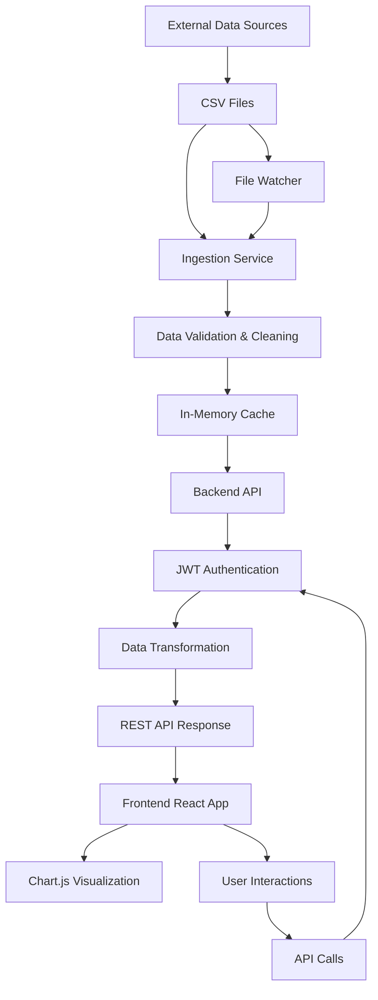
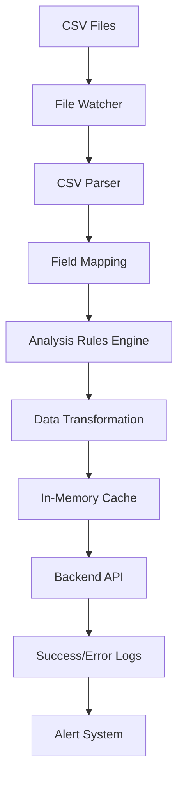

# MGNREGA Dashboard

A Node.js-based web application for monitoring district-level performance metrics of MGNREGA (Mahatma Gandhi National Rural Employment Guarantee Act) programs in Uttar Pradesh, India.

## Project Overview and Objectives

This system provides district-level performance metrics for MGNREGA programs using real CSV data from Uttar Pradesh districts, enhanced with machine learning capabilities for predictive analytics and data quality monitoring. The dashboard features a responsive HTML/JS frontend with API-driven data visualization, real-time CSV file watching, ML-powered data imputation, and production-ready error handling.

### Key Objectives

- Display MGNREGA performance metrics for Uttar Pradesh districts
- Provide interactive data visualizations with Chart.js
- Implement real-time data updates via CSV file watching
- Enable ML-powered predictive analytics and data imputation
- Ensure robust data quality monitoring and validation
- Deliver a responsive, user-friendly interface for government officials
- Provide production-ready monitoring and alerting capabilities

## System Architecture Overview

The system consists of three main components:

```
┌─────────────────┐    ┌─────────────────┐    ┌─────────────────┐
│   Frontend      │    │   Backend API   │    │   CSV Data      │
│   (HTML/JS)     │◄──►│   (Node.js)     │◄──►│   Files          │
└─────────────────┘    └─────────────────┘    └─────────────────┘
```

### Component Descriptions

1. **Frontend (HTML/JavaScript)**

   - Static HTML page with embedded JavaScript
   - Responsive design using Tailwind CSS
   - Interactive charts using Chart.js
   - District selection dropdown with API population
   - Help modal for metric explanations
   - ML insights display for predictive analytics

2. **Backend API (Node.js/Express)**

   - RESTful API endpoints running on port 31254
   - Simple JWT-based authentication (guest access)
   - In-memory data caching for fast access
   - CSV file parsing and transformation with ML imputation
   - File watching for real-time data reloading
   - Machine learning endpoints for predictive analytics
   - Data quality monitoring and validation

3. **CSV Data Files**

   - Primary data source: `data.csv` with Uttar Pradesh district data
   - Configurable field mappings for data transformation
   - In-memory storage for processed district metrics
   - Real-time file watching with chokidar for automatic updates
   - State filtering to show only Uttar Pradesh districts
   - ML-powered data imputation for missing values

## Technology Stack

### Frontend

- **HTML/JavaScript** - Static page with embedded JavaScript
- **Tailwind CSS** - Utility-first CSS framework via CDN
- **Chart.js** - Data visualization library via CDN
- **Lucide** - Icon library via CDN
- **Fetch API** - HTTP client for API calls

### Backend

- **Node.js 18+** - Runtime environment
- **Express.js** - Web framework
- **csv-parser** - CSV file parsing
- **chokidar** - File watching for real-time updates
- **jsonwebtoken** - JWT authentication
- **dotenv** - Environment variable management
- **Custom ML Algorithms** - Linear regression, classification, time series forecasting, anomaly detection, clustering

### Data Storage

- **CSV Files** - Primary data storage format (`data.csv`)
- **In-Memory Cache** - Fast data access and processing
- **File System** - Local storage for CSV files

### Data Processing

- **Node.js** - Data processing and transformation
- **csv-parser** - CSV parsing with configurable field mappings
- **chokidar** - File watching for automated data updates
- **Custom Analysis Rules** - Configurable data transformation logic
- **ML Algorithms** - Predictive analytics and data imputation
- **Data Quality Engine** - Validation, safe parsing, and completeness tracking

## Data Flow Explanation

### Ingestion to Display Flow

1. **Data Ingestion**

   ```
   External Sources → CSV Files → Ingestion Service → Data Validation → In-Memory Cache
   ```

2. **User Request Flow**

   ```
   User Login → JWT Token → API Request → Data Retrieval → Frontend Display
   ```

3. **Real-time Updates**
   ```
   Scheduled Ingestion → File Watcher → Data Reload → Frontend Update
   ```

### Detailed Data Flow Diagram



## CSV Data Structures and Configuration

### CSV File Format

The system uses configurable CSV files as the primary data source. Each CSV file contains district-level MGNREGA metrics with the following structure:

```csv
district_code,district_name,month,Total_Individuals_Worked,percentage_payments_gererated_within_15_days
UP_LUCKNOW,Lucknow,2024-01,145000,85.5
UP_VARANASI,Varanasi,2024-01,120000,78.2
UP_AGRA,Agra,2024-01,95000,65.1
```

### Configuration Object

The system uses a centralized CONFIG object to define field mappings and analysis rules:

```javascript
const CONFIG = {
  CSV_FILE_PATH: "my_data.csv",
  MAPPINGS: {
    districtId: "district_code",
    districtName: "district_name",
    peopleEmployed: "Total_Individuals_Worked",
    workAvailabilityValue: "Total_Individuals_Worked", // raw value for analysis
    paymentSpeedValue: "percentage_payments_gererated_within_15_days",
    stateComparisonValue: "Total_Individuals_Worked", // placeholder, could be compared to state avg
    historicalEmployed: "Total_Individuals_Worked", // for simplicity, use array of last 6 values if available
  },
  ANALYSIS_RULES: {
    workAvailability: {
      thresholds: { high: 150000, medium: 75000 },
      labels: { high: "High", medium: "Medium", low: "Low" },
      colors: { high: "green", medium: "yellow", low: "red" },
    },
    paymentSpeed: {
      thresholds: { good: 80, okay: 50 },
      labels: { good: "Good", okay: "Okay", bad: "Bad" },
      colors: { good: "green", okay: "yellow", bad: "red" },
    },
    peopleEmployed: (value) => {
      if (value >= 100000) return `${(value / 100000).toFixed(2)} Lakh`;
      if (value >= 1000) return `${(value / 1000).toFixed(2)} Thousand`;
      return value.toString();
    },
    stateComparison: (value) => {
      // Placeholder: assume "Better" if > 100000, else "Worse"
      return value > 100000 ? "Better" : "Worse";
    },
    stateComparisonColor: (value) => {
      return value > 100000 ? "green" : "red";
    },
  },
};
```

### In-Memory Data Structure

Data is loaded from CSV files into an in-memory cache for fast access:

```javascript
let csvData = {
  UP_LUCKNOW: {
    raw: {
      /* latest CSV row */
    },
    historicalEmployed: [12000, 13000, 12500, 14000, 13500, 14500],
  },
  UP_VARANASI: {
    raw: {
      /* latest CSV row */
    },
    historicalEmployed: [11000, 11500, 11800, 11200, 11700, 11900],
  },
};
```

### File Watching and Updates

The system uses file watchers to automatically reload data when CSV files are updated:

```javascript
// Watch for CSV file changes
chokidar.watch(CONFIG.CSV_FILE_PATH).on("change", () => {
  console.log("CSV file changed, reloading...");
  loadCsvData();
});
```

## JWT Authentication Details

### Token Structure

```javascript
// Access Token Payload
{
  "sub": "user_id",           // Subject (user ID)
  "username": "admin_lucknow",
  "role": "district_admin",
  "districtAccess": ["up_lucknow"],
  "iat": 1638360000,          // Issued at
  "exp": 1638363600,          // Expires at (1 hour)
  "iss": "mgnrega-dashboard"  // Issuer
}

// Refresh Token Payload
{
  "sub": "user_id",
  "tokenId": "unique_token_id",
  "iat": 1638360000,
  "exp": 1641042000,          // Expires at (30 days)
  "iss": "mgnrega-dashboard"
}
```

### Authentication Flow

1. **Login Process**

   ```
   Client → POST /api/auth/login → Server
   Server validates credentials → Generate JWT pair → Return tokens
   ```

2. **Token Refresh**

   ```
   Client → POST /api/auth/refresh → Server
   Server validates refresh token → Generate new JWT pair → Return tokens
   ```

3. **API Access**
   ```
   Client → GET /api/districts (with Authorization header) → Server
   Server validates JWT → Check permissions → Return data
   ```

### Security Features

- Access tokens expire in 15 minutes
- Refresh tokens expire in 30 days
- Tokens stored in httpOnly cookies
- Automatic token refresh on API calls
- Role-based access control (RBAC)

## Ingestion Service Description

The Ingestion Service is responsible for parsing, validating, and transforming MGNREGA data from CSV files into a structured format for the backend API. It uses configurable field mappings and analysis rules to process data on-demand.

### Key Features

1. **CSV File Processing**

   - Configurable CSV parsing with custom field mappings
   - Support for multiple CSV files with different schemas
   - Real-time file watching for automatic data updates
   - In-memory caching for fast data access

2. **Data Transformation Process**

   - **Parse**: Read CSV files using configurable field mappings
   - **Transform**: Apply analysis rules to convert raw data into display metrics
   - **Cache**: Store processed data in memory for quick API responses

3. **Analysis Rules Engine**

   - Configurable thresholds for metric categorization (High/Medium/Low)
   - Custom formatting functions for display values (Lakh/Thousand formatting)
   - Color coding based on performance levels
   - Historical data aggregation from multiple time periods

4. **Real-time Updates**

   - File system watchers for automatic data reloading
   - Event-driven processing when CSV files are modified
   - Graceful handling of file parsing errors
   - Logging for data processing events

### Architecture



## Deployment and Scalability Considerations

### Scalability

- **Horizontal Scaling**: Multiple backend instances behind load balancer
- **File System Distribution**: CSV files stored on network-attached storage (NAS)
- **In-Memory Caching**: Redis for frequently accessed processed data
- **CDN**: Static assets served via CDN

### High Availability

- **Multi-region Deployment**: Services deployed across multiple availability zones
- **File System Redundancy**: CSV files backed up and replicated across locations
- **Load Balancing**: Distribute traffic across healthy instances
- **Health Checks**: Automated monitoring and self-healing

### Performance Optimization

- **In-Memory Indexing**: Fast lookups using JavaScript object keys
- **API Caching**: Cache expensive computations
- **Data Aggregation**: Pre-compute metrics for faster retrieval
- **Lazy Loading**: Load data on demand in frontend

### Monitoring & Logging

- **Application Metrics**: Response times, error rates, throughput
- **Infrastructure Monitoring**: CPU, memory, disk usage
- **Log Aggregation**: Centralized logging with ELK stack
- **Alerting**: Automated alerts for critical issues

## Security Measures

### Authentication & Authorization

- JWT-based authentication with short-lived access tokens
- Role-based access control (RBAC) with granular permissions
- Multi-factor authentication (MFA) for admin accounts
- Session management with secure cookies

### Data Protection

- File system encryption for CSV files at rest
- Data encryption in transit (TLS 1.3)
- Sensitive data masking in logs
- Regular security audits and penetration testing
- Access controls for CSV file directories

### API Security

- Rate limiting to prevent abuse
- Input validation and sanitization
- CORS configuration for allowed origins
- API versioning for backward compatibility

### Infrastructure Security

- Network segmentation with security groups
- Web Application Firewall (WAF)
- Regular security updates and patches
- Backup and disaster recovery procedures

### Compliance

- GDPR compliance for data protection
- Indian data localization requirements
- Audit trails for all data access and modifications
- Data retention policies

## Getting Started

### Prerequisites

- Node.js 18+
- CSV data file (`data.csv`) with Uttar Pradesh district data

### Installation

1. Ensure you have the project files including `server.js`, `index.html`, `data.csv`, etc.

2. Install dependencies:

   ```bash
   npm install
   ```

3. Set up environment variables:

   The `.env` file should contain:

   ```env
   JWT_SECRET=your_jwt_secret_here
   PORT=31254
   ```

4. Start the server:

   ```bash
   npm start
   ```

5. Open your browser and navigate to `http://localhost:31254`

### Key Features

- **CSV-based Data Ingestion**: Loads real Uttar Pradesh district data from `data.csv`
- **Machine Learning Analytics**: Linear regression, classification, time series forecasting, anomaly detection, and clustering
- **Data Quality Monitoring**: Validation, safe parsing, completeness tracking, and alerting
- **ML-Powered Data Imputation**: Predictive filling of missing values
- **Dynamic District Dropdown**: Populated from API, filtered for Uttar Pradesh districts
- **Real-time Updates**: CSV file changes trigger automatic data reloading and ML recalculation
- **ML API Endpoints**: Dedicated endpoints for predictive analytics
- **Production Monitoring**: Data quality metrics and alerting system
- **Error Handling**: Fallback to mock data if API fails, with ML predictions for missing data
- **Responsive Design**: Works on desktop and mobile devices
- **Interactive Charts**: 6-month historical employment trends using Chart.js

## API Endpoints

### Authentication Endpoints

### GET /api/auth/token

Generates a guest JWT token for API access.

### Data Endpoints

### GET /api/districts

Returns list of Uttar Pradesh districts from CSV data.

- Requires JWT authentication
- Filters districts by state_name === "UTTAR PRADESH"

### GET /api/data/:districtId

Returns processed metrics for a specific district.

- Requires JWT authentication
- Applies analysis rules and formatting
- Includes historical employment data and ML insights

### Machine Learning Endpoints

### GET /api/ml/predict-employment/:districtId

Predicts missing employment values using linear regression.

- Requires JWT authentication
- Returns predicted employment with confidence level

### GET /api/ml/classify-payment/:districtId

Classifies payment speed categories using rule-based classification.

- Requires JWT authentication
- Returns predicted payment speed category

### GET /api/ml/forecast-employment/:districtId

Forecasts next month employment using exponential smoothing.

- Requires JWT authentication
- Returns employment forecast with confidence level

### GET /api/ml/detect-anomaly/:districtId

Detects anomalous district performance using statistical methods.

- Requires JWT authentication
- Returns anomaly detection results with z-score

### GET /api/ml/cluster-districts

Groups districts by performance patterns using k-means clustering.

- Requires JWT authentication
- Returns district clusters with performance labels

### GET /api/ml/config

Returns current ML feature configuration.

- Requires JWT authentication
- Shows enabled/disabled ML features

### Monitoring Endpoints

### GET /api/data-quality

Returns data quality metrics and monitoring information.

- Requires JWT authentication
- Includes completeness scores, validation counts, and alerts

## CSV Data Format

The system expects `data.csv` with the following columns:

- `district_code`: Unique district identifier (e.g., UP_LUCKNOW)
- `district_name`: District name (e.g., Lucknow)
- `state_name`: State name (must be "UTTAR PRADESH" for filtering)
- `month`: Data month in YYYY-MM format
- `Total_Individuals_Worked`: Number of people employed
- `percentage_payments_gererated_within_15_days`: Payment speed percentage

## Features

- **Real-time CSV Watching**: Uses chokidar to monitor `data.csv` for changes
- **State Filtering**: Only shows Uttar Pradesh districts
- **Machine Learning Integration**: Predictive analytics for data imputation and insights
- **Data Quality Monitoring**: Comprehensive validation and completeness tracking
- **Production-Ready Monitoring**: Data quality metrics and alerting system
- **ML API Endpoints**: Dedicated endpoints for predictive analytics
- **Error Resilience**: Falls back to mock data if API fails, with ML predictions for missing data
- **Comprehensive Logging**: Detailed console output for debugging with timestamps
- **Responsive UI**: Mobile-friendly design with Tailwind CSS
- **Interactive Charts**: Historical employment trends visualization
- **ML Insights Display**: Shows predictive analytics results in the dashboard

## Development

The application runs on port 31254 as configured in the `.env` file. The server automatically reloads CSV data when the file is modified, making it easy to update district metrics in real-time during development. ML models are recalculated on data updates, and comprehensive logging provides insights into data processing and quality metrics.

### ML Feature Configuration

ML features can be enabled/disabled via the `CONFIG.ML_FEATURES` object in `server.js`:

```javascript
ML_FEATURES: {
  enabled: true, // Master switch for all ML features
  linearRegression: true, // Employment prediction
  classification: true, // Payment speed classification
  timeSeriesForecasting: true, // Employment forecasting
  anomalyDetection: true, // Anomaly detection
  clustering: true, // District clustering
}
```

### Data Quality Monitoring

The system provides real-time data quality monitoring through:

- Console logging with timestamps for all data processing events
- Completeness scoring and alerting for low-quality data
- Validation counts and error tracking
- Safe parsing with graceful degradation for invalid values
- Production-ready monitoring endpoint (`/api/data-quality`)
