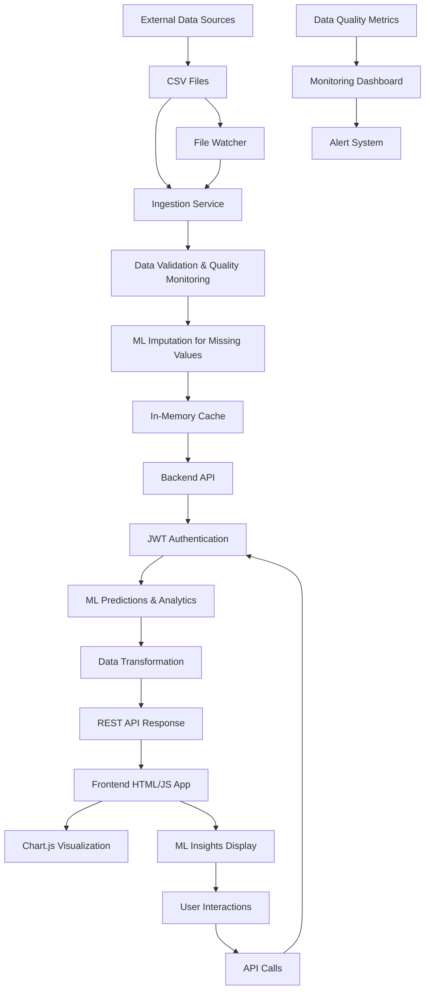

# MGNREGA Dashboard Current Implementation Architecture

## Overview

This document outlines the current technical architecture of the MGNREGA Dashboard system, a production-ready Node.js-based web application that provides district-level performance metrics for MGNREGA (Mahatma Gandhi National Rural Employment Guarantee Act) programs in Uttar Pradesh, India. The system features machine learning-powered predictive analytics, comprehensive data quality monitoring, and real-time CSV data ingestion with automatic reloading. It serves a responsive HTML/JS frontend with interactive visualizations and robust error handling.

## System Architecture

### High-Level Components

```
┌─────────────────┐    ┌─────────────────┐    ┌─────────────────┐
│   Frontend      │    │   Backend API   │    │   CSV Data      │
│   (HTML/JS)     │◄──►│   (Node.js)     │◄──►│   Files          │
└─────────────────┘    └─────────────────┘    └─────────────────┘
```

### Component Descriptions

1. **Frontend (HTML/JavaScript)**

   - Static HTML page with embedded JavaScript
   - Responsive design using Tailwind CSS
   - Interactive charts using Chart.js
   - Real-time data visualization via API calls
   - District selection dropdown with dynamic population
   - Help modal for metric explanations
   - ML insights display for predictive analytics

2. **Backend API (Node.js/Express)**

   - RESTful API endpoints running on port 31254
   - Simple JWT-based authentication (guest access)
   - In-memory data caching for fast access
   - CSV file parsing and transformation with ML-powered imputation
   - File watching for real-time data reloading
   - Machine learning endpoints for predictive analytics
   - Data quality monitoring and validation
   - Enhanced error handling and logging

3. **CSV Data Files**

   - Primary data source: `data.csv` with Uttar Pradesh district data
   - Configurable field mappings for data transformation
   - In-memory storage for processed district metrics
   - Real-time file watching with chokidar for automatic updates
   - State filtering to show only Uttar Pradesh districts
   - ML-powered data imputation for missing values

## Data Flow

### Ingestion to Display Flow

1. **Data Ingestion**

   ```
   External Sources → CSV Files → Ingestion Service → Data Validation → ML Imputation → In-Memory Cache
   ```

2. **User Request Flow**

   ```
   User Login → JWT Token → API Request → ML Predictions → Data Retrieval → Frontend Display
   ```

3. **Real-time Updates**
   ```
   CSV File Changes → File Watcher → Data Reload → ML Recalculation → Cache Update
   ```

### Detailed Data Flow Diagram



## CSV Data Structures and Configuration

### CSV File Format

The system uses configurable CSV files as the primary data source. Each CSV file contains district-level MGNREGA metrics with the following structure:

```csv
district_code,district_name,month,Total_Individuals_Worked,percentage_payments_gererated_within_15_days
UP_LUCKNOW,Lucknow,2024-01,145000,85.5
UP_VARANASI,Varanasi,2024-01,120000,78.2
UP_AGRA,Agra,2024-01,95000,65.1
```

### Configuration Object

The system uses a centralized CONFIG object to define field mappings, analysis rules, and ML feature toggles:

```javascript
const CONFIG = {
  CSV_FILE_PATH: "data.csv",
  MAPPINGS: {
    districtId: "district_code",
    districtName: "district_name",
    peopleEmployed: "Total_Individuals_Worked",
    workAvailabilityValue: "Total_Individuals_Worked", // raw value for analysis
    paymentSpeedValue: "percentage_payments_gererated_within_15_days",
    stateComparisonValue: "Total_Individuals_Worked", // placeholder, could be compared to state avg
    historicalEmployed: "Total_Individuals_Worked", // for simplicity, use array of last 6 values if available
  },
  ANALYSIS_RULES: {
    workAvailability: {
      thresholds: { high: 150000, medium: 75000 },
      labels: { high: "High", medium: "Medium", low: "Low" },
      colors: { high: "green", medium: "yellow", low: "red" },
    },
    paymentSpeed: {
      thresholds: { good: 80, okay: 50 },
      labels: { good: "Good", okay: "Okay", bad: "Bad" },
      colors: { good: "green", okay: "yellow", bad: "red" },
    },
    peopleEmployed: (value) => {
      if (value >= 100000) return `${(value / 100000).toFixed(2)} Lakh`;
      if (value >= 1000) return `${(value / 1000).toFixed(2)} Thousand`;
      return value.toString();
    },
    stateComparison: (value) => {
      // Placeholder: assume "Better" if > 100000, else "Worse"
      return value > 100000 ? "Better" : "Worse";
    },
    stateComparisonColor: (value) => {
      return value > 100000 ? "green" : "red";
    },
  },
  ML_FEATURES: {
    enabled: true, // Master switch to enable/disable all ML features
    linearRegression: true, // Predict missing employment
    classification: true, // Predict payment speed categories
    timeSeriesForecasting: true, // Forecast next month employment
    anomalyDetection: true, // Detect unusual performance
    clustering: true, // Group districts by patterns
  },
};
```

### In-Memory Data Structure

Data is loaded from CSV files into an in-memory cache for fast access:

```javascript
let csvData = {
  UP_LUCKNOW: {
    raw: {
      /* latest CSV row */
    },
    historicalEmployed: [12000, 13000, 12500, 14000, 13500, 14500],
  },
  UP_VARANASI: {
    raw: {
      /* latest CSV row */
    },
    historicalEmployed: [11000, 11500, 11800, 11200, 11700, 11900],
  },
};
```

### File Watching and Updates

The system uses file watchers to automatically reload data when CSV files are updated:

```javascript
// Watch for CSV file changes
chokidar.watch(CONFIG.CSV_FILE_PATH).on("change", () => {
  console.log("CSV file changed, reloading...");
  loadCsvData();
});
```

## JWT Authentication Implementation

### Current Implementation

The current system uses simplified JWT authentication with guest access:

```javascript
// Guest Token Payload
{
  "role": "guest",
  "iat": 1638360000,          // Issued at
  "exp": 1638363600,          // Expires at (1 hour)
  "iss": "mgnrega-dashboard"  // Issuer
}
```

### Authentication Flow

1. **Token Generation**

   ```
   Client → GET /api/auth/token → Server
   Server generates guest JWT → Return token
   ```

2. **API Access**
   ```
   Client → GET /api/districts (with Authorization header) → Server
   Server validates JWT → Return data
   ```

### Security Features

- Guest tokens expire in 1 hour
- Simple role-based access (guest role)
- JWT middleware for API protection

## CSV Data Processing and Machine Learning Integration

### Current Implementation

The system processes CSV data directly in the Node.js server using the csv-parser library with configurable field mappings, analysis rules, and integrated machine learning capabilities for predictive analytics and data quality enhancement.

### Key Features

1. **CSV File Processing**

   - Single CSV file (`data.csv`) with Uttar Pradesh district data
   - Configurable field mappings for data transformation
   - Real-time file watching with chokidar for automatic updates
   - In-memory caching for fast API responses
   - ML-powered data imputation for missing values

2. **Data Quality Monitoring**

   - Comprehensive validation of district data
   - Safe parsing with graceful degradation for invalid values
   - Completeness tracking and alerting
   - Detailed logging for data quality issues
   - Production-ready error handling

3. **Machine Learning Integration**

   - **Linear Regression**: Predicts missing employment values based on historical trends
   - **Classification**: Predicts payment speed categories using rule-based classification
   - **Time Series Forecasting**: Forecasts next month employment using exponential smoothing
   - **Anomaly Detection**: Identifies unusual district performance using statistical methods
   - **Clustering**: Groups districts by performance patterns using k-means clustering

4. **Data Transformation Process**

   - **Parse**: Read CSV using csv-parser with custom field mappings
   - **Validate**: Apply data quality checks and safe parsing
   - **Impute**: Use ML models to fill missing values
   - **Transform**: Apply analysis rules to convert raw data into display metrics
   - **Cache**: Store processed data in memory for quick access

5. **Analysis Rules Engine**

   - Configurable thresholds for metric categorization (High/Medium/Low)
   - Custom formatting functions for display values (Lakh/Thousand formatting)
   - Color coding based on performance levels
   - Historical data aggregation from multiple time periods
   - ML insights integration for enhanced decision making

6. **Real-time Updates**

   - File system watchers for automatic data reloading
   - Event-driven processing when CSV files are modified
   - ML model recalculation on data updates
   - Console logging for data processing events
   - State filtering to show only Uttar Pradesh districts

### Architecture

```mermaid
graph TD
       A[CSV File (data.csv)] --> B[File Watcher (chokidar)]
       B --> C[CSV Parser (csv-parser)]
       C --> D[Data Validation & Quality Checks]
       D --> E[ML Imputation Engine]
       E --> F[Field Mapping]
       F --> G[Analysis Rules Engine]
       G --> H[ML Predictions & Analytics]
       H --> I[Data Transformation]
       I --> J[In-Memory Cache]
       J --> K[Express API Endpoints]
       K --> L[ML API Endpoints]
       L --> M[Data Quality Monitoring]
       M --> N[Console Logs & Alerts]
```

## Current Technology Stack

### Frontend

- **HTML/JavaScript** - Static page with embedded JavaScript
- **Tailwind CSS** - Utility-first CSS framework via CDN
- **Chart.js** - Data visualization library via CDN
- **Lucide** - Icon library via CDN
- **Fetch API** - HTTP client for API calls

### Backend

- **Node.js 18+** - Runtime environment
- **Express.js** - Web framework
- **csv-parser** - CSV file parsing
- **chokidar** - File watching for real-time updates
- **jsonwebtoken** - JWT authentication
- **dotenv** - Environment variable management
- **Custom ML Algorithms** - Linear regression, classification, time series forecasting, anomaly detection, clustering

### Data Storage

- **CSV Files** - Primary data storage format (`data.csv`)
- **In-Memory Cache** - Fast data access and processing
- **File System** - Local storage for CSV files

### Data Processing

- **Node.js** - Data processing and transformation
- **csv-parser** - CSV parsing with configurable field mappings
- **chokidar** - File watching for automated data updates
- **Custom Analysis Rules** - Configurable data transformation logic
- **ML Algorithms** - Predictive analytics and data imputation
- **Data Quality Engine** - Validation, safe parsing, and completeness tracking

## Current Deployment and Features

### Server Configuration

- **Port**: 31254 (configured in .env file)
- **Static File Serving**: Serves index.html and assets from root directory
- **CORS**: Not explicitly configured (default Express behavior)
- **Error Handling**: Basic error middleware with console logging

### Key Features Implemented

1. **CSV-based Data Ingestion with ML Enhancement**

   - Real Uttar Pradesh district data from `data.csv`
   - Automatic data reloading on file changes
   - State filtering for Uttar Pradesh districts only
   - ML-powered data imputation for missing values

2. **Machine Learning Predictive Analytics**

   - Linear regression for employment prediction
   - Classification for payment speed categorization
   - Time series forecasting for trend analysis
   - Anomaly detection for unusual performance
   - Clustering for district performance grouping

3. **Data Quality Monitoring**

   - Comprehensive validation and safe parsing
   - Completeness tracking with alerting
   - Graceful degradation for invalid data
   - Production-ready error handling and logging

4. **Dynamic District Dropdown**

   - Populated from API endpoint `/api/districts`
   - Filters districts by state_name === "UTTAR PRADESH"
   - Auto-selects first district on load

5. **ML API Endpoints**

   - `/api/ml/predict-employment/:districtId` - Employment prediction
   - `/api/ml/classify-payment/:districtId` - Payment speed classification
   - `/api/ml/forecast-employment/:districtId` - Employment forecasting
   - `/api/ml/detect-anomaly/:districtId` - Anomaly detection
   - `/api/ml/cluster-districts` - District clustering
   - `/api/ml/config` - ML feature configuration

6. **Enhanced Error Handling**

   - Fallback to mock data if API fails
   - Graceful error display for failed requests
   - ML predictions for missing data
   - Console logging for debugging

7. **Real-time CSV Watching**

   - Uses chokidar to monitor `data.csv` for changes
   - Automatic data reload and cache update
   - ML model recalculation on data updates
   - Console logging for file change events

8. **Production-Ready Monitoring**

   - Data quality metrics endpoint (`/api/data-quality`)
   - Comprehensive logging with timestamps
   - Alert system for low data completeness
   - Performance monitoring and error tracking

This implementation provides a production-ready MGNREGA Dashboard with real CSV data integration, machine learning capabilities, comprehensive data quality monitoring, and robust error handling, running on port 31254 with real-time updates and predictive analytics.
